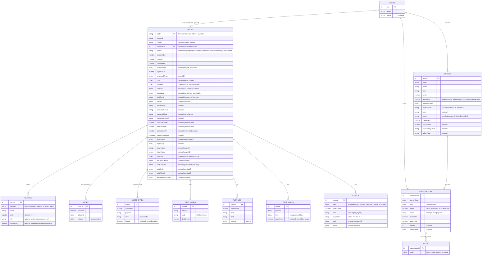

# Database — Schema, Indexes & Data Model

Source of truth: `convex/schema.ts` (346 lines). Convex is a document database — every table is
a collection of JSON-like documents with two automatic system fields, `_id` and
`_creationTime`. There is no separate migration system: `defineSchema`/`defineTable` *is* the
schema, enforced on every write.

## 1. Entity-Relationship Diagram

`USERS` (and `authAccounts`/`authSessions`/`authRefreshTokens`/`authVerifiers`, not shown above)
come from `...authTables` (`@convex-dev/auth/server`), spread into the schema at
`convex/schema.ts:57`.

## 2. Tables & Indexes

| Table | Indexes | Why |
|---|---|---|
| `rooms` | `by_code` (`code`) | The only lookup path — every player/mutation resolves a room by its 4-letter code. |
| `players` | `by_room` (`roomId`); `by_room_player` (`roomId, playerId`) | Roster listing, and O(1) lookup of "is this playerId seated here." |
| `votes` | `by_room_round` (`roomId, roundId`) | Only the current round's votes are ever read; old rounds' votes are dead weight left for the room-sweep to purge. |
| `questCards` | `by_room_quest` (`roomId, questIndex`) | Same pattern, scoped to the active quest. |
| `plotHands` | `by_room` (`roomId`); `by_room_player` (`roomId, playerId`) | Public hand-count queries need `by_room`; a player's own hand needs `by_room_player`. |
| `plotLog` | `by_room` (`roomId`) | Public log, read in full per room. |
| `plotMarks` | `by_room` (`roomId`) | Charge/revealCard marks, read in full per room (small, bounded by player count). |
| `secrets` | `by_room_to` (`roomId, toId`) | **Security-critical**: this index is what makes it structurally impossible for `getRoom` to leak another player's private information — the query is scoped to `toId === playerId` at the index level, not filtered after the fact. |
| `subscriptions` | `by_owner` (`ownerUserId`); `by_status` (`status`) | Owner lookup for `mySubscription`; admin listing/filtering. |
| `seats` | `by_email` (`email`); `by_subscription` (`subscriptionId`) | `by_email` is the entitlement check's hot path (`entitlementForEmail`); `by_subscription` backs seat-list rewrites. |
| `orders` | `by_status` (`status`); `by_user` (`userId`) | Admin queue filtering; a buyer's own order history. |

Per the Convex guidelines this project follows (`convex/_generated/ai/guidelines.md`), every
index name spells out its fields in order (`by_room_round`, not `by_room` reused for two field
orders), and no query in this codebase uses `.filter()` in place of an index — confirmed across
`avalon.ts` and `billing.ts` by the research passes behind this document set.

## 3. Notable Schema Design Choices

- **No unbounded arrays of growing child records.** Votes, quest cards, plot hands, plot log,
  plot marks, and secrets are all **separate tables** with a `roomId` foreign key, not arrays
  embedded in the `rooms` document — exactly the pattern the Convex guidelines require ("do not
  store unbounded lists as an array field inside a document... create a separate table for the
  child items"). The `rooms` document itself does hold several small, *bounded* arrays
  (`questResults` — capped at 5 quests; `questLog` — capped at 5; `proposedTeam` — capped at the
  largest quest size; `loyaltyDeck`/`loyaltyLog` — capped at 5) which is fine at that fixed size.
- **`players.departedAt` is a soft-delete/presence flag, not a deletion.** A seated player who
  disconnects mid-game keeps their row (and seat index) — deleting it would resize the table
  under a deck already dealt. See [PATTERNS.md](./PATTERNS.md) and [FLOWS.md](./FLOWS.md) for
  how "present" vs "seated" is distinguished in resolution logic.
- **`secrets.toId` as the privacy boundary.** Rather than storing an "is this visible to me"
  computed flag, the schema encodes recipient-scoping directly into the row's addressing
  (`by_room_to`), so a bug in query logic elsewhere in the codebase cannot accidentally return
  another player's secret — the index itself won't return it.
- **`orders.amountInr` is snapshotted, not computed on read.** The schema comment
  (`convex/schema.ts:99`) states this explicitly: a later price change must never rewrite the
  history of what a buyer was actually charged.
- **`subscriptions.seats` vs. table size are deliberately decoupled.** The schema comment
  (`convex/schema.ts:59-62`) and `convex/entitlements.ts`/`convex/logic.ts` (`seatCap()`) agree:
  `seats` is purely a billing figure (how many emails a plan covers), and has no relationship to
  how many people can sit at a game table (always up to `MAX_PLAYERS = 18`, tier-independent).
- **Roles live in `players.role`, populated only at `startGame`.** Before the game starts, and
  for every row other than the querying player's own, `getRoom` nulls this field out at the
  query layer (not by omitting it from the schema) — see [SECURITY.md](./SECURITY.md).
