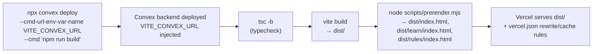

# Deployment Architecture

## 1. Platforms

- **Frontend hosting**: Vercel, serving the static `dist/` output produced by Vite.
- **Backend**: Convex's own managed deployment (separate "dev" and "production" deployments —
  they share no data or environment variables).
- **Email**: Resend (transactional only), spoken to via plain `fetch`, no SDK dependency.
- **Payments**: none integrated — manual UPI QR + admin approval (see
  [FLOWS.md](./FLOWS.md#flow-8-purchase--admin-approval--entitlement-unlock)).

## 2. Build Pipeline



`vercel.json`'s `buildCommand` is exactly:

```
npx convex deploy --cmd-url-env-var-name VITE_CONVEX_URL --cmd 'npm run build'
```

`convex deploy` pushes every function in `convex/*` to the target Convex deployment first, then
runs the wrapped `npm run build` (`"tsc -b && vite build && node scripts/prerender.mjs"`) with
`VITE_CONVEX_URL` already set to that deployment's URL — this is why `VITE_CONVEX_URL` is never
hand-configured in Vercel's dashboard; it's injected by the deploy command itself. The **only**
Vercel dashboard environment variable needed is `CONVEX_DEPLOY_KEY` (from the Convex dashboard →
project → Settings → Deploy keys → the **production** key).

### `vercel.json` — routing & caching

```json
{
  "framework": "vite",
  "outputDirectory": "dist",
  "headers": [{ "source": "/assets/(.*)", "headers": [{ "key": "Cache-Control", "value": "public, max-age=31536000, immutable" }] }],
  "rewrites": [{ "source": "/((?!assets/).*)", "destination": "/index.html" }]
}
```

- The rewrite is a negative-lookahead SPA catch-all: anything **not** under `/assets/` resolves
  to `index.html`, so a hard refresh on `/rules` or `/play?code=ABCD` still serves the app rather
  than 404ing.
- Vercel resolves static files **before** applying rewrites, so `dist/learn/index.html` and
  `dist/rules/index.html` (written by the prerender step) are served directly for those paths,
  and only paths without a matching static file fall through to the SPA rewrite.
- The year-long immutable cache on `/assets/*` is safe because Vite fingerprints asset filenames
  by content hash.

## 3. SEO / Prerendering

`scripts/prerender.mjs` runs **after** `vite build`, as a dependency-free Node script that does
string templating over the already-built `dist/index.html` — deliberately not a full render of
the React components, since those depend on Convex hooks and CSS imports that don't survive a
bare Node render, and the build must not gain a step that can fail on bundling.

For exactly three routes (`/`, `/learn`, `/rules`) it writes a dedicated file
(`dist/index.html`, `dist/learn/index.html`, `dist/rules/index.html`) with its own
`<title>`, `<meta name="description">`, `<link rel="canonical">`, `og:title`, `og:description`,
and `og:url` (built from `ORIGIN`, i.e. `process.env.SITE_ORIGIN ?? "https://www.decevia.space"`)
— plus a hand-authored `body` snippet injected into `<div id="root">` so a JS-less crawler or
link-preview scraper sees real content instead of an empty mount point.

This is safe with client hydration because `src/main.tsx:154` calls `createRoot(...).render(...)`,
which **replaces** the container's children rather than hydrating them — there is no mismatch to
manage between the prerendered snapshot and what React actually renders once JS loads.

`/signin`, `/upgrade`, `/admin`, and `/play` are **not** prerendered — only the fully public
marketing surface gets a crawlable static document. `public/robots.txt` explicitly disallows
`/play`, `/admin`, and `/upgrade` (a council code is not a page worth indexing).

**The domain string is duplicated in four places** and must be kept in sync: `index.html`'s
`<head>`, `public/robots.txt`, `public/sitemap.xml`, and `ORIGIN` in `scripts/prerender.mjs`
(overridable per-build via `SITE_ORIGIN`). A canonical mismatch here (e.g. serving both the apex
and `www` without a redirect) reads to Google as duplicate content.

## 4. Environment Variables

All of the following are **Convex deployment** environment variables (`npx convex env set NAME
value [--prod]`), not Vercel variables, and are **per-deployment** — setting one on `dev` has no
effect on `production`.

| Variable | Required? | Effect if unset |
|---|---|---|
| `RESEND_API_KEY` | For any email | Welcome notes silently skipped; password reset **fails loudly** (the user is actively waiting for it). |
| `EMAIL_FROM` | To mail anyone but the Resend account owner | Falls back to `onboarding@resend.dev`, which Resend only delivers to its own account owner. Format: `Name <you@your-domain.com>`, and the domain must be Resend-verified. |
| `SITE_URL` | Yes, in production | Origin used in email links. Defaults to `http://localhost:5173` — must be set to the real origin before going live. |
| `ADMIN_EMAILS` | No | Comma-separated. Defaults to a single hardcoded fallback address. Being listed here **is** the entire admin authorization mechanism — there is no separate admin password/role. |
| `UPI_VPA` | For payments | No dynamic payment QR can be generated (a static `PAYMENT_QR_URL` can substitute). |
| `UPI_PAYEE_NAME` | No | Defaults to `Decevia`. |
| `PAYMENT_QR_URL` | No | If set, the client shows this hosted static QR image instead of generating one from `UPI_VPA`. |
| `PRICE_MONTHLY_INR` / `PRICE_YEARLY_INR` | No | Default to `299` / `2499`. |
| `SUBSCRIPTION_SEATS` | No | Default `7` — a **billing** figure (how many emails a plan covers), unrelated to game table size. |
| `JWKS` / `JWT_PRIVATE_KEY` | Yes | Written once by `npx @convex-dev/auth [--prod]`. Sign-in cannot function without them. **Never rotate casually — rotating signs out every user.** |
| `CONVEX_SITE_URL` | Auto-set by Convex | The JWT issuer domain (`convex/auth.config.ts`) — not something you set manually. |

The client separately reads `VITE_CONVEX_URL` (and `VITE_CONVEX_SITE_URL`, currently unused by
any code path) from `.env.local`, written automatically by `npx convex dev` in development and
injected automatically by `npx convex deploy --cmd-url-env-var-name` in production builds.

## 5. First-Time Production Setup

```bash
npx convex deploy              # creates the production deployment
npx @convex-dev/auth --prod    # writes JWKS + JWT_PRIVATE_KEY — sign-in needs them
npx convex env set SITE_URL https://your-domain --prod
# ...set the rest of the table above with --prod as needed
```

Then sign up on the live site using an address listed in `ADMIN_EMAILS` — production shares no
accounts with the dev deployment, so the admin console must be re-bootstrapped per environment.

## 6. Recurring Operational Jobs

- **`sweepAbandonedRooms`** — the one Convex cron, every 6 hours, purging rooms older than 12h.
  See [FLOWS.md](./FLOWS.md#flow-10-abandoned-room-sweep-cron).
- **Subscription expiry** — there is no cron for this. `entitlementForEmail()`
  (`convex/entitlements.ts:93-115`) recomputes `expiresAt > now` on every read, so a lapsed plan
  simply stops unlocking content the next time anyone checks — nothing needs to sweep it.
- **Account deletion** — no self-serve flow exists. Removing an account means manually deleting
  its `users` row plus its `authAccounts`/`authSessions`/`authRefreshTokens` rows from the Convex
  dashboard, and being aware that `subscriptions.ownerUserId`, `orders.userId`, and
  `rooms.hostUserId` all reference that row.
- **Secret rotation** — `RESEND_API_KEY` is the only third-party secret in the project; rotating
  it is a plain `convex env set` with no other coordination required.

## 7. Local Development

```bash
npm install
npx convex dev     # terminal 1 — first run logs in, creates a dev deployment,
                    # writes convex/_generated/*, writes .env.local
npm run dev         # terminal 2 — starts Vite
```

Multiplayer testing locally: open the printed localhost URL in multiple browser tabs/windows —
each tab generates its own `playerId` in `sessionStorage`, so each is a distinct "player" at the
same table.
