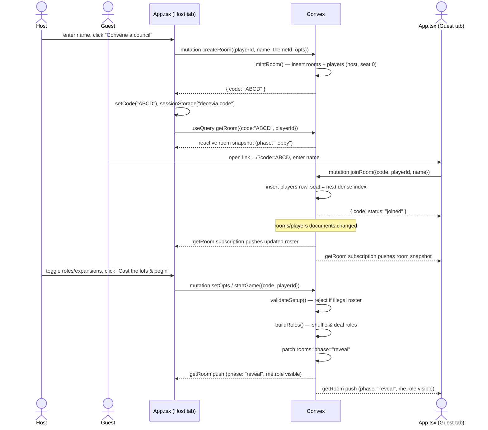
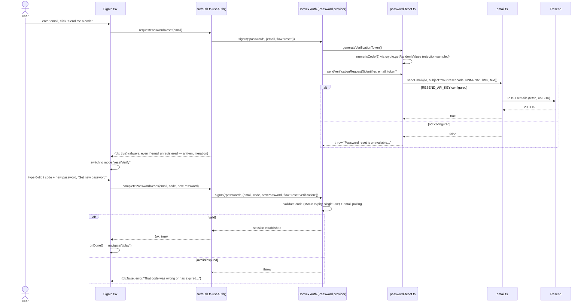
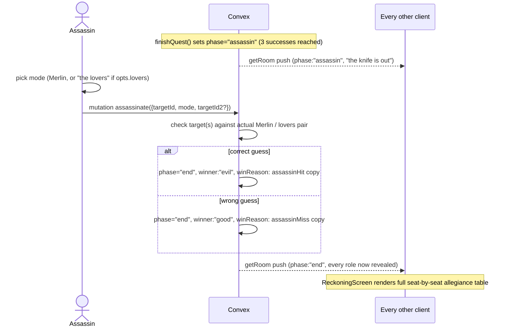
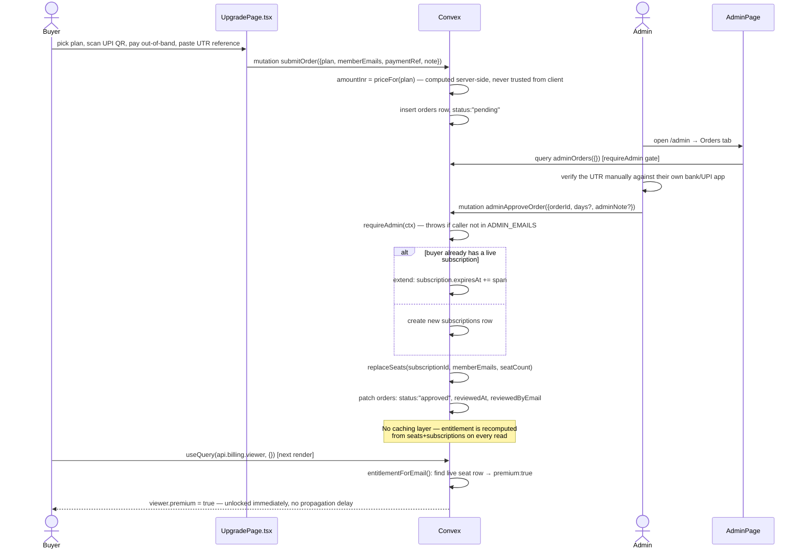
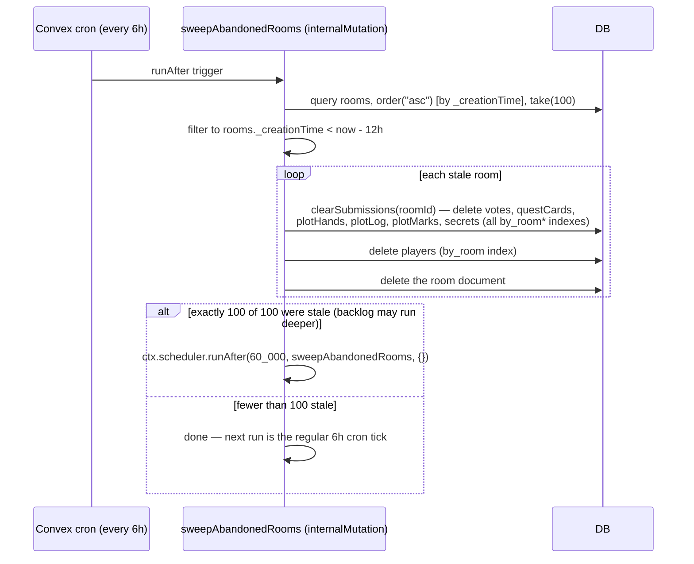

# End-to-End Flows

Ten representative flows through the system, each with a trigger, a sequence diagram, a
step-by-step walkthrough, and the error/edge paths that matter.

## Flow 1: Create a Room → Join → Start a Game

**Trigger**: a player opens `/`, clicks "Convene," enters a name.



**Notes**: `startGame` (`avalon.ts:974`) re-validates the roster server-side even though
`LobbyScreen` already ran the identical `validateSetup()` client-side (imported straight from
`convex/logic.ts`) to disable the start button — the client check is a UX convenience, the
server check is the actual gate. If a client somehow submits an illegal roster anyway (stale UI,
tampered request), `startGame` throws and no roles are dealt.

## Flow 2: Password Reset

**Trigger**: a user on `/signin` clicks "Forgot your password?"



**Error-path asymmetry (deliberate)**: an unconfigured `RESEND_API_KEY` makes the *reset* email
fail loudly (the user is actively waiting for it), while the same missing key makes the
*welcome* email on sign-up fail silently, logged only via `console.error` — the account is
created either way, since a welcome note isn't worth failing a sign-up over
(`convex/email.ts` header comment; see [SECURITY.md](./SECURITY.md#4-authentication-security)).

## Flow 3: Propose → Vote → Rejection (Leadership Rotates)

**Trigger**: the round enters `propose`; the leader names a team the table doesn't approve.

```mermaid
sequenceDiagram
    actor Leader
    actor PlayerB
    participant Convex

    Note over Convex: enterPropose() sets discussEndsAt, selectEndsAt,<br/>schedules passSealIfLeaderIsSilent
    Leader->>Convex: mutation proposeTeam({code, playerId, team[], excaliburId?})
    Convex->>Convex: validate team size (QUEST_SIZES), no departed members
    Convex->>Convex: patch rooms: proposedTeam, phase="vote"; clear phaseEndsAt
    Convex-->>Leader: getRoom push (phase:"vote")
    Convex-->>PlayerB: getRoom push (phase:"vote")

    Leader->>Convex: mutation castVote({choice:"reject"})
    PlayerB->>Convex: mutation castVote({choice:"reject"})
    Note over Convex: castVote counts only presentOf(seated) —<br/>departed players never block resolution
    Convex->>Convex: resolveVotes(): all present voted, rejecters > approvers
    Convex->>Convex: applyRejection(): rejectCount++, NOT >= MAX_REJECTS(5)
    Convex->>Convex: leaderIndex = (leaderIndex+1) % n; roundId++; enterPropose()
    Convex-->>Leader: getRoom push (phase:"propose", new leader, lastVote public)
    Convex-->>PlayerB: getRoom push (phase:"propose", new leader, lastVote public)
    Note over Leader,PlayerB: RevealCeremony plays the "unveil" animation<br/>off room.lastVote — approvers/rejecters now public
```

**If this were the 5th consecutive rejection**, `applyRejection` (`avalon.ts:342-352`) sets
`phase:"end", winner:"evil"` instead of rotating leadership — five rejected proposals in a row is
an outright evil win, no further play. **If the leader instead lets the clock run out** without
proposing, `passSealIfLeaderIsSilent` (`avalon.ts:1059-1091`) rotates leadership the same way but
records `lastSkip` and does **not** touch `rejectCount` — a timeout is explicitly not a
rejection, per `README.md`'s clock table.

## Flow 4: Quest Resolution with Excalibur

**Trigger**: all riders on an approved team have submitted their quest cards, and Excalibur is
armed (holder is a party member).

```mermaid
sequenceDiagram
    actor Rider1
    actor Rider2
    actor SwordHolder
    participant Convex

    Rider1->>Convex: mutation playQuestCard({card:"success"})
    Convex->>Convex: clampQuestCard() — server enforces role-legal card
    Rider2->>Convex: mutation playQuestCard({card:"fail"})
    Convex->>Convex: afterAllQuestCards(): all riders in, swordArmed(room)==true
    Convex->>Convex: phase="excalibur", enterTimedPhase(45s), schedule autoAdvance
    Convex-->>SwordHolder: getRoom push (phase:"excalibur", questProgress counts only)

    SwordHolder->>Convex: mutation useExcalibur({targetId: Rider2.playerId})
    Convex->>Convex: flip that questCards row (fail→success), flipped:true
    Convex->>Convex: record public lastExcalibur {holderId, targetId, used:true}
    Convex->>Convex: finishQuest(): tally fails vs failsNeeded(n, questIndex)
    alt fails >= failsNeeded
        Convex->>Convex: questResults[i]="fail"; check 3-fail evil win
    else
        Convex->>Convex: questResults[i]="success"; check 3-success → assassin phase
    end
    Convex->>Convex: build lastQuest (transient) + append questLog (durable)
    Convex-->>Rider1: getRoom push (new phase, lastQuest public summary)
    Convex-->>Rider2: getRoom push (new phase, lastQuest public summary)
    Note over Rider1,Rider2: RevealCeremony's QuestUnveil plays card-flip animation;<br/>plate does not turn red until GSAP timeline reaches "settled"
```

**Timeout branch**: if nobody acts within 45s, `autoAdvance(phase:"excalibur")`
(`avalon.ts:1143-1155`) records non-use and calls `finishQuest` anyway — the sword holder cannot
stall the table by disconnecting.

## Flow 5: Lady of the Lake

**Trigger**: a quest (index 1–3, i.e. after quest 2, 3, or 4) just resolved, the room has 7+
players with `opts.lady` enabled, and a never-inspected target remains.

```mermaid
sequenceDiagram
    actor Holder
    participant Convex

    Note over Convex: finishQuest() opens the lady window automatically
    Convex->>Convex: enterTimedPhase("lady", 60s), schedule autoAdvance
    Convex-->>Holder: getRoom push (phase:"lady", eligible targets minus ladyHistory)

    Holder->>Convex: mutation useLady({targetId})
    Convex->>Convex: insert secrets row {toId: Holder, kind:"lady", team: currentTeam(target)}
    Convex->>Convex: ladyHolder = targetId; ladyHistory.push(target)
    Convex->>Convex: record public lastLady {holderId, targetId} — never the result
    Convex->>Convex: beginRound(questIndex+1) — next round begins
    Convex-->>Holder: getRoom push — mySecrets now contains the private allegiance read
    Note over Holder: Only Holder's getRoom response contains this secret,<br/>scoped by the secrets.by_room_to index
```

Everyone else at the table sees only the public fact that an inspection happened and who was
targeted — never the result. If the 60s timer expires unattended, `autoAdvance(phase:"lady")`
auto-assigns the first eligible un-inspected target and performs the identical secret-write, so
the game never stalls on a disconnected holder.

## Flow 6: Plot Card — "Ambush" (the only card with zero public trace)

**Trigger**: a player holding the Ambush card plays it during the `quest` or `excalibur` window.

```mermaid
sequenceDiagram
    actor Ambusher
    actor Target
    participant Convex

    Ambusher->>Convex: mutation playPlotCard({card:"ambush", targetId})
    Convex->>Convex: delete Ambusher's plotHands row for "ambush"
    Convex->>Convex: read Target's already-played questCards row
    Convex->>Convex: insert secrets row {toId: Ambusher, kind:"ambush", card: Target's card}
    Note over Convex: NOT written to plotLog — the one card type<br/>that leaves no public record at all
    Convex-->>Ambusher: getRoom push — mySecrets now reveals Target's card
    Convex-->>Target: getRoom push — nothing different; Target never learns they were ambushed
```

Contrast with **"We Found You"**, which is the opposite extreme: it writes a `plotMarks` row
(`kind:"revealCard"`) that forces the target's card to be publicly shown in `lastQuest.revealed`
once the quest resolves — a fully public reveal rather than a private one.

## Flow 7: Assassin's Strike (Endgame)

**Trigger**: Good has just completed its 3rd successful quest; phase enters `assassin`.



Only at this final `getRoom` push does the per-viewer role/team filtering described in
[SECURITY.md](./SECURITY.md) lift — `phase === "end"` is the one condition under which every
player's role becomes visible to every viewer.

## Flow 8: Purchase → Admin Approval → Entitlement Unlock

**Trigger**: a signed-in user submits a UPI payment reference on `/upgrade`.



**Trust boundary**: the client never supplies `amountInr`; `priceFor(plan)`
(`entitlements.ts:178-181`) is the sole source, and `orders.amountInr` is snapshotted at
submission so a later price change can't retroactively alter what was charged
(`schema.ts:99`). See [SECURITY.md](./SECURITY.md#5-payment--admin-trust-boundary).

## Flow 9: Disconnect & Rejoin

**Trigger**: a seated player's tab closes mid-game; they open the invite link again later.

```mermaid
sequenceDiagram
    actor Player
    participant TabA as Original tab (dead)
    participant TabB as New tab (same browser, or new device)
    participant Convex

    Note over TabA,Convex: Tab closes — server is told nothing directly
    Note over Convex: room stays exactly as it was;<br/>Player's players row is untouched until they act again

    Player->>TabB: open invite link, type the SAME name, click Join
    TabB->>Convex: mutation joinRoom({code, playerId: NEW random id, name, rejoin: false})
    Convex->>Convex: normalizeName(name) matches an existing seated player
    Convex-->>TabB: { status: "nameTaken" } — does NOT transfer the seat yet
    TabB->>TabB: show "X is already at that table — rejoin as X?"

    Player->>TabB: click "Rejoin as X"
    TabB->>Convex: mutation joinRoom({code, playerId, name, rejoin: true})
    Convex->>Convex: clear departedAt on the ORIGINAL players row
    Convex-->>TabB: { code, playerId: ORIGINAL id, status: "rejoined" }
    TabB->>TabB: sessionStorage["decevia.pid"] = ORIGINAL id; setPid(original)
    TabB->>Convex: useQuery getRoom({code, playerId: ORIGINAL id})
    Convex-->>TabB: full room state — role, votes cast, quest cards, everything reunited
```

**Why the two-step**: an automatic silent takeover on name match would let anyone who merely
knows a seated player's display name steal their seat by typing it into a join form. Requiring
an explicit `rejoin: true` confirmation is a deliberate (if non-cryptographic) speed bump — see
[SECURITY.md](./SECURITY.md#7-known-accepted-weaknesses-documented-not-oversights).

**If the game was still in `lobby`** when the player left, their row was deleted outright
(seats stay dense via `compactSeats`) rather than marked `departedAt` — there's no dealt state to
preserve yet, so "rejoin" there is really just "join again."

## Flow 10: Abandoned Room Sweep (Cron)

**Trigger**: the 6-hourly cron fires (`convex/crons.ts`), or a prior sweep found a full batch and
self-rescheduled.



**Why batched at 100**: a Convex mutation is one atomic transaction with hard ceilings (4,096
index-range reads, 16,000 writes). Purging one room costs ~7 index reads plus every row hanging
off it; an unbounded sweep on a large backlog could exceed those limits and roll back the
**entire** transaction — nothing purged, and the backlog never shrinks. The self-reschedule after
60s (rather than waiting for the next 6-hour tick) is what actually drains a large backlog in a
reasonable time. The identical `purgeRoom`/`clearSubmissions` pair also backs the manual
**"Close council"** mutation (`avalon.ts:810-818`) — one purge implementation, two callers.
