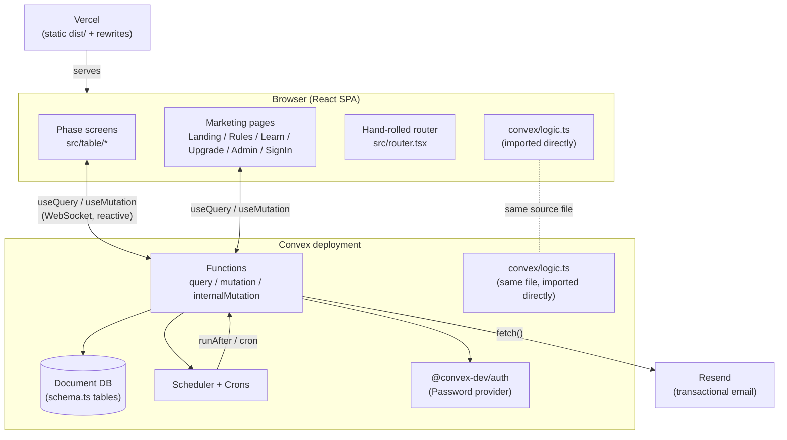
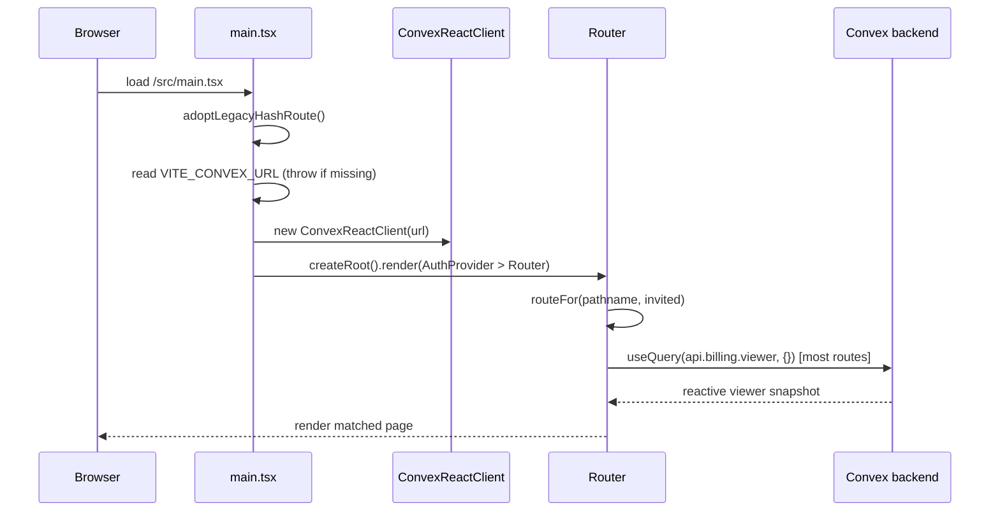
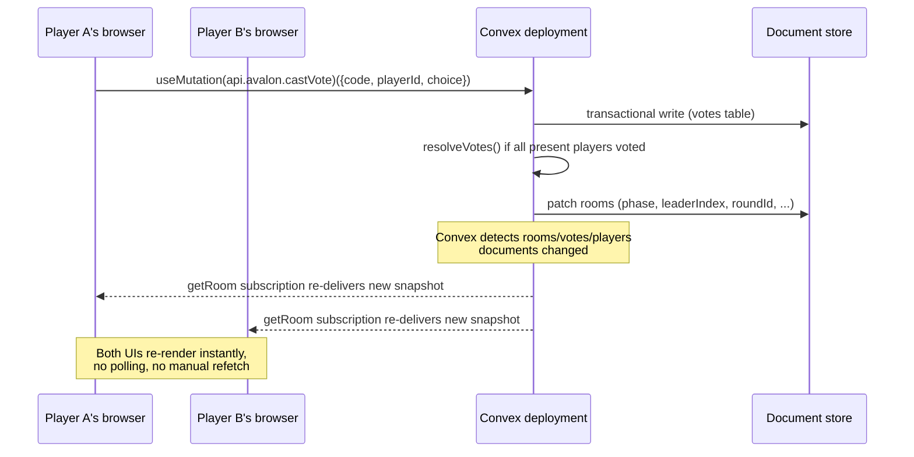
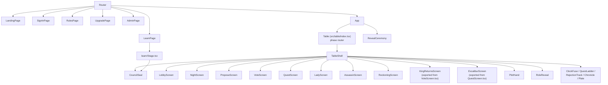

# Decevia — Architecture Overview

## 1. Executive Summary

**Decevia** ("Where friends become foes") is a real-time, multiplayer **social deduction** web
game for 5–18 players, built as an Avalon engine with five renamable "world" skins (only two —
`medieval` and `india` — are currently offered to new games; see [§9](#9-a-live-discrepancy-worth-knowing)).
Players gather physically around one screen-per-person, each on their own phone, and use a
4-letter room code to join a shared game state that updates live for everyone via Convex's
reactive query subscriptions — no polling, no manual refresh.

Two user types exist:

- **Players** — anonymous by default. A name plus a `playerId` generated into
  `sessionStorage` is the entire identity needed to sit at a table (`src/App.tsx:34-43`).
- **Account holders** — a small superset of players who sign in (email + password) to hold or
  buy a subscription seat, or to reach `/admin`. Signing in is never required to play.

Around the game engine sits a self-serve subscription business (manual UPI QR payment +
admin approval, no payment gateway) and a marketing/SEO layer (landing page, rules, an
animated "how to play" walkthrough, and a hand-authored prerender pass for crawlers).

## 2. Technology Stack

| Layer | Technology | Notes |
|---|---|---|
| Frontend framework | React 18.3 + TypeScript 5.6 | `package.json` |
| Build tool | Vite 5.4 (`@vitejs/plugin-react`) | `vite.config.ts` — no extra plugins |
| Backend | **Convex** ^1.17 | Reactive backend-as-a-service: functions + a document database + subscriptions, replacing a conventional REST/ORM stack |
| Auth | `@convex-dev/auth` ^0.0.95 + `@auth/core` | Email + password only, no OAuth |
| Email | Resend, via plain `fetch` (no SDK) | `convex/email.ts` |
| Animation | GSAP ^3.15 | Vote/quest "unveil" ceremony, landing page hero, learn-page beats |
| Icons | `lucide-react` | |
| QR codes | `qrcode.react` (`QRCodeSVG`) | Renders the UPI payment deep link |
| Routing | ~90-line hand-rolled router (`src/router.tsx`) | `pushState`/`popstate`, no library |
| Hosting | Vercel (static `dist/` + SPA rewrite) | `vercel.json` |
| Prerendering | Custom Node script, no framework | `scripts/prerender.mjs`, runs after `vite build` |

There is no separate database, ORM, cache layer, or message queue — Convex's document store,
transactional functions, scheduler, and cron system cover all of those roles for this app.

## 3. Architecture Pattern

This is a **full-stack reactive application**, not a classic layered MVC/REST backend. The
closest classification:

- **Frontend**: a component-per-game-phase React SPA (no Redux/Zustand — server state lives
  entirely in Convex's reactive cache via `useQuery`; local component state handles only
  transient UI concerns like an in-progress team selection).
- **Backend**: **Convex functions as the entire backend** — `query` (read, reactive,
  cacheable), `mutation` (transactional write), and `internalMutation` (scheduler/cron-only,
  unreachable from clients) are the only three "layers." There is no separate
  controller/service/repository split; `convex/avalon.ts` *is* the controller, service, and
  repository for the game domain, deliberately, because Convex mutations are already
  transactional and schema-validated at the boundary.
- **One pure logic core**: `convex/logic.ts` holds every rule as framework-free functions (no
  `ctx`, no I/O). It is imported by *both* the server (`convex/avalon.ts`) and the client
  (`src/table/*`, `src/RulesPage.tsx`, `src/LearnPage.tsx`), which is the project's load-bearing
  architectural decision: **the client cannot invent a rule the server disagrees with**,
  because they share the literal source file.



## 4. Application Bootstrap & Initialization

Entry point: `src/main.tsx`.

1. `adoptLegacyHashRoute()` runs **before** the first render (`src/main.tsx:80`), rewriting any
   leftover `#/play`-style link to a real path so `useLocation()` never sees the old hash form.
2. `const url = import.meta.env.VITE_CONVEX_URL` is read; if missing, the script writes an
   error directly into `document.body` and throws — the app refuses to boot without a Convex
   deployment configured (`src/main.tsx:23-30`).
3. `const convex = new ConvexReactClient(url)` is constructed once at module scope
   (`src/main.tsx:32`).
4. `createRoot(...).render(<StrictMode><AuthProvider client={convex}><Router /></AuthProvider></StrictMode>)`
   (`src/main.tsx:154-162`). `AuthProvider` (from `src/auth.ts`) wraps `ConvexAuthProvider`
   with `shouldHandleCode: () => false` (critical — see [§8](#8-authentication--authorization)).
5. `Router()` (`src/main.tsx:82-132`) reads the current path via `useLocation()`, resolves it to
   one of seven logical routes via `routeFor()`, sets `document.title`/description via
   `useDocumentMeta()`, and renders the matching page. The `landing` route renders outside the
   shared `.vd-board` shell ("paints its own board"); every other route shares it.
6. Mounting: `createRoot()` **replaces** the container's children rather than hydrating —
   deliberate, so the prerendered static HTML (see [§13](#13-seo--prerendering)) never has to
   match what React renders (no hydration-mismatch risk).



## 5. The Convex "Request Lifecycle" (Reactive Query/Mutation Cycle)

Convex has no HTTP request/response cycle for app data (only `convex/http.ts`'s
`/api/auth/*` routes are conventional HTTP). Instead:

- **Reads** (`query` functions) are subscribed to via `useQuery(api.module.fn, args)`. Convex
  tracks exactly which documents/indexes each query touched; any mutation that writes an
  overlapping document automatically re-runs and re-pushes the query result to every subscribed
  client over its WebSocket connection — this is the reactivity that replaces manual polling or
  cache invalidation.
- **Writes** (`mutation` functions) are single-shot RPCs from `useMutation(api.module.fn)(args)`,
  each executing as one atomic, serializable transaction against the document store.
- **`getRoom`** (`convex/avalon.ts:1750`) is the single query the entire game UI subscribes to.
  Every phase screen, every plot-card interaction, every vote/quest count — all of it flows from
  one `useQuery(api.avalon.getRoom, { code, playerId })` call in `src/App.tsx:123-126`. This is
  the project's second load-bearing convention: **one read model, filtered per-viewer inside the
  query itself** (see [SECURITY.md](./SECURITY.md) for exactly how it hides roles/votes/cards).



## 6. Routing Architecture

`src/router.tsx` (~104 lines) is a from-scratch router: `pushState`/`replaceState`, a
`popstate` listener (`useLocation`), and one document-level click interceptor
(`useLinkInterception`) that turns any in-app `<a href="/rules">` into a client-side navigation.
There is no route nesting and no third-party router dependency.

`routeFor(pathname, invited)` (`src/main.tsx:135-152`) maps a path to one of seven logical
routes:

| Path | Route name | Page |
|---|---|---|
| `/` (default) | `landing` | `LandingPage` |
| `/play` (or any path with `?code=` — an invite link) | `game` | `App` (the table) |
| `/learn` | `learn` | `LearnPage` (lazy-loaded) |
| `/rules` | `rules` | `RulesPage` |
| `/signin` | `signin` | `SignInPage` |
| `/upgrade` | `upgrade` | `UpgradePage` |
| `/admin` | `admin` | `AdminPage` |

Unknown paths fall through to `landing` — there is no 404 page. `vercel.json` rewrites every
non-asset path to `index.html` so a refresh on `/rules` still serves the SPA (see
[DEPLOYMENT.md](./DEPLOYMENT.md)).

## 7. Component Architecture (Frontend)



See [COMPONENTS.md](./COMPONENTS.md) for a per-component catalog. Key conventions:

- **Phase routing is a flat conditional list**, not a lookup table (`src/table/index.tsx:67-115`)
  — `room.phase` selects exactly one screen, plus two "overlay" phases (`kingReturns`,
  `excalibur`) and `PlotHand`, which renders unconditionally under every phase.
- **`TableActions`** (`src/table/index.tsx:20-48`) is the single interface every screen uses to
  trigger a mutation; it's implemented once in `src/App.tsx:269-311`, so every mutation call and
  every error goes through one funnel (`act`/`wrap`, `src/App.tsx:206-213,314-321`).
- **`Room` type derivation** — `src/table/types.ts:9-13` derives the entire `Room` TypeScript
  type from `FunctionReturnType<typeof api.avalon.getRoom>` rather than hand-declaring it. A
  server-side field rename or removal breaks the client at compile time instead of silently
  drifting.

## 8. Authentication & Authorization

- **Provider**: `@convex-dev/auth`'s `Password` provider only (`convex/auth.ts:19-28`) — no
  OAuth client id/secret, no consent screen, no third party in the sign-in path.
- **JWT issuer**: `convex/auth.config.ts` declares `domain: process.env.CONVEX_SITE_URL,
  applicationID: "convex"` — required for `ctx.auth.getUserIdentity()` to ever resolve.
- **HTTP surface**: `convex/http.ts` mounts `auth.addHttpRoutes(http)` at `/api/auth/*`.
- **Client wiring**: `src/auth.ts` is *the only file allowed to name the auth vendor* — every
  screen calls its provider-neutral `useAuth()` hook (`signInWithEmail`, `createAccount`,
  `requestPasswordReset`, `completePasswordReset`, `signOut`). It wraps `ConvexAuthProvider`
  with `shouldHandleCode: () => false` (`src/auth.ts:41`) — **required**, because Decevia's
  invite links are `?code=ABCD` and Convex Auth's default behavior treats any `?code=` as an
  OAuth credential to consume and strip from the URL, which would silently sign out and
  code-strip every player who joined via a shared link.
- **Password reset**: a 6-digit, `crypto.getRandomValues`-based code (not `Math.random`),
  15-minute expiry, single-use, delivered by email; the reset request **always reports success**
  regardless of whether the email is registered (anti-enumeration). See
  [FLOWS.md](./FLOWS.md#flow-2-password-reset) for the full sequence.
- **Authorization**: two independent gates, both server-derived from `ctx.auth`, never from a
  client argument:
  - **Premium**: `entitlementForEmail()` (`convex/entitlements.ts:93-115`) looks up a live
    (`status:"active" && expiresAt > now`) seat for the caller's email.
  - **Admin**: `isAdminEmail()` (`convex/entitlements.ts:41-44`) checks the caller's email
    against the `ADMIN_EMAILS` env var. There is no separate admin password or role field.
- **Game-level authorization is identity-free by design**: a player's authority in a room
  (leader, party member, card holder, etc.) is derived entirely from room/player documents keyed
  on the client-generated `playerId`, not from the signed-in account — playing needs no account
  at all. See [SECURITY.md](./SECURITY.md) for the full trust model.

## 9. A Live Discrepancy Worth Knowing

The project's `README.md` describes **five** playable worlds (Indian Mythology, Medieval
Kingdom, Egyptian Gods, Greek Mythology, Maratha Empire). Direct inspection of
`convex/themes.ts:1130` shows:

```ts
export const PLAYABLE_THEME_IDS = ["medieval", "india"] as const;
// "Playable worlds. Other keys in THEMES stay for older rooms."
```

All five `ThemeConfig` entries still exist in the `THEMES` record (so rooms created while
`egyptian`/`greek`/`maratha` were offered still resolve correctly), but `THEME_LIST` — what the
theme picker actually renders — is derived only from `PLAYABLE_THEME_IDS`. **Only Medieval and
Indian Mythology are currently selectable for new games.** Anyone updating docs, marketing copy,
or tests based on "five worlds" should reconcile against this constant first, since it is the
actual gate.

## 10. Deployment Architecture

See [DEPLOYMENT.md](./DEPLOYMENT.md) for the full pipeline, environment variable reference, and
the SEO/prerender mechanism. In short: `vercel.json`'s `buildCommand` runs
`npx convex deploy --cmd-url-env-var-name VITE_CONVEX_URL --cmd 'npm run build'`, which deploys
the Convex backend first, injects the resulting URL into the Vite build, builds the SPA, then
runs `scripts/prerender.mjs` to hand-write crawlable HTML for `/`, `/learn`, and `/rules`.

## 11. Testing

The Convex guidelines this project follows (`convex/_generated/ai/guidelines.md`) prescribe
`convex-test` + `vitest` + `@edge-runtime/vm` for backend function tests, with test files inside
`convex/` and schema/module maps supplied via `import.meta.glob`. `README.md` notes that the
5–10 player team/quest-size tables in `convex/logic.ts` are literals asserted against by test
formulas, so a future refactor of the "beyond ten" extrapolation can't silently change the
printed Avalon numbers. No test files were enumerated by this pass — see
[REFERENCE.md](./REFERENCE.md) for how to run whatever suite exists (`npm run` scripts) and
confirm current coverage directly against the repo before relying on this section.

## 12. Where to Read Next

- [FLOWS.md](./FLOWS.md) — ten end-to-end sequence walkthroughs (create/join, propose→vote→
  reject, quest+Excalibur, Lady of the Lake, plot cards, assassination, password reset,
  purchase→approval, disconnect/rejoin, room sweep).
- [DATABASE.md](./DATABASE.md) — full schema, indexes, and an ER diagram.
- [API.md](./API.md) — every Convex query/mutation, grouped by module, with args and purpose.
- [SECURITY.md](./SECURITY.md) — the server-authoritative trust model, in depth.
- [COMPONENTS.md](./COMPONENTS.md) — the frontend component catalog.
- [PATTERNS.md](./PATTERNS.md) — how-to guides and anti-patterns for extending this codebase.
- [DEPLOYMENT.md](./DEPLOYMENT.md) — build pipeline, env vars, SEO/prerendering.
- [REFERENCE.md](./REFERENCE.md) — quick-lookup tables, file index, commands.
