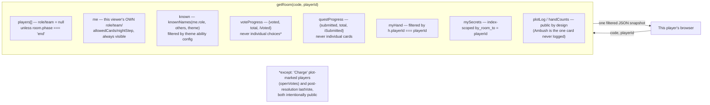

# Security Architecture

Decevia's security model is unusual for two reasons worth stating up front: (1) most players
never authenticate at all — a name and a client-generated `playerId` are sufficient to play a
full game — and (2) the interesting attack surface is not "who is this user" but "what does this
specific document reveal to this specific viewer," because Convex ships one server-rendered
JSON payload per query and the client can inspect it in DevTools regardless of what the UI
chooses to display. Both are addressed by keeping every secret-holding decision **inside** the
Convex function, never in client-side rendering logic.

## 1. Identity Model

Two separate, mostly-independent identities exist:

- **`playerId`** — a random string generated into `sessionStorage` on first load
  (`src/App.tsx:34-43`, `PID_KEY = "decevia.pid"`). This is a room's entire notion of "who are
  you" — no signature, no server-issued token. It is deliberately per-tab: a refresh keeps it, a
  new tab or incognito window gets a new one. Trade-off called out directly in `README.md`:
  "anyone in the room who knows one [name] can claim that seat" via the rejoin flow — this is a
  known, accepted weakness for a game played by people physically sitting together, not a
  defense against a remote attacker.
- **Convex Auth identity** (`ctx.auth.getUserIdentity()`) — only present for signed-in account
  holders, resolved via the JWT issuer configured in `convex/auth.config.ts`. This identity
  governs **billing and admin** access only. It is never required to join or play a game.

Never conflate these: a room's `hostId` is a `playerId` (works for anonymous hosts); a room's
optional `hostUserId` is the Convex Auth user id, present only if the host was signed in, and it
is what `roomEntitlement()` reads to decide whether the room gets premium content
(`convex/entitlements.ts:138-145`).

## 2. Server-Authoritative Game State — `getRoom`'s Per-Viewer Filtering

`getRoom` (`convex/avalon.ts:1750-2031`) is the **only** query the game client subscribes to, and
it is the single place all of the following secrecy rules are enforced. None of this is done by
the client choosing not to render a field — every field the client is not entitled to see is
either nulled out or simply absent from the JSON Convex sends over the wire.

Concretely:

1. **Role/team secrecy** — every player's `role`/`team` in the `players` array is `null` unless
   `room.phase === "end"` (`avalon.ts:1765,1978-1980`). The viewer's own role is exposed
   separately under `me` (`avalon.ts:2002-2017`) — the one deliberate exception, since a player
   always knows their own role.
2. **Night knowledge (`known`)** — computed via `knownNames(me.role, others, theme)`
   (`logic.ts:736-766`), which filters the full seated-with-roles list down to only the names the
   viewer's specific role is entitled to see, per the active theme's `abilities` config
   (`reveal` by `target.roles` or `target.team`, minus `excludeRoles`). It returns **names
   only** — never another player's raw role or team fields.
3. **Vote secrecy** — full vote rows for the round are read server-side to compute results, but
   `getRoom` only ever returns **counts** (`voteProgress`) to the client, never who voted which
   way — except (a) players marked by the `charge` plot card, whose choice is deliberately public
   from the moment it's cast (`openVotes`, `avalon.ts:1819-1823`), and (b) `lastVote.approvers`/
   `rejecters`, which is public **only after** a vote has already resolved (Avalon's votes are
   printed as public; this just delays the reveal to the resolution moment, not before).
4. **Quest card secrecy** — same shape as votes: `questProgress` exposes only counts. The actual
   `success`/`fail` value of any card is never returned by `getRoom`, except via
   `lastQuest.revealed` (only for players a "We Found You" plot card forced public,
   `avalon.ts:424-434`) or via a private `secrets` row delivered only to the one player who
   ambushed them.
5. **Plot hand secrecy** — `handCounts` (how many cards each player holds) is public by design
   (Avalon's plot expansion prints hand *size* as visible information); `myHand` returns only
   rows where `h.playerId === playerId` (`avalon.ts:1948-1955`). **Ambush** is the one card type
   that leaves zero public trace — not even in `plotLog` (`avalon.ts:1533`).
6. **The `secrets` table is the structural guarantee, not a filter.** `mySecrets` is fetched via
   the `by_room_to` index scoped to `toId === playerId` (`avalon.ts:1803-1808`,
   `schema.ts:333-345`). Because the index itself is the query boundary, there is no code path
   inside `getRoom` capable of returning another player's secret — a future bug in filtering
   logic elsewhere cannot leak it, because there is no "elsewhere" for this data to leak from.
7. **Lady of the Lake / Excalibur** — public metadata (*who* inspected/targeted *whom*, and
   whether a card was flipped) is exposed; the *result* of the inspection or the pre-flip card
   value is never exposed publicly, only via the recipient's own `secrets` row.
8. **Watchers** get no role field at all (`avalon.ts:1986-1991`) — they have none; the schema
   never assigns one.
9. **Seat cap / entitlement is host-derived, not viewer-derived** — `roomEntitlement(ctx, room)`
   reads the *host's* plan (`avalon.ts:1758-1761`), so table size and unlocked content are
   identical for every viewer of the same room regardless of who is asking.

**Practical implication for anyone extending this codebase**: if you add a new piece of
per-player secret information, model it as a `secrets` row addressed by `toId`
(or an equivalent index-scoped table), never as a field you plan to "just not render" on other
players' rows — the existing design assumes the wire payload itself carries no secret a viewer
isn't entitled to.

## 3. Card/Vote Tampering Resistance

A modified client could attempt to submit an illegal quest card (e.g. a good Lancelot trying to
play Fail). This is blocked server-side, not client-side: `clampQuestCard()`
(`convex/logic.ts:507-531`) is invoked from `playQuestCard` (`avalon.ts:1296-1301`) and forces
the card to the player's actual allowed set based on role/`currentTeam()`/the `goodMayFail`
house rule — the client's own `allowedCards` hint (used only to disable buttons) is informational,
never authoritative. Similarly, `proposeTeam` re-validates party size and Excalibur-holder
placement server-side rather than trusting the client's selection.

## 4. Authentication Security

- **Password reset codes**: generated with `crypto.getRandomValues` (never `Math.random`),
  6 digits, rejection-sampled to avoid modulo bias (`convex/passwordReset.ts:24-34`), 15-minute
  expiry, single-use (enforced by Convex Auth's `Email()` provider internals). The code alone is
  insufficient — Convex Auth's `reset-verification` flow requires the original email paired with
  it, so an intercepted code is worthless without also knowing the target address.
- **Anti-enumeration**: `requestPasswordReset()` (`src/auth.ts:127-147`) always resolves
  `{ ok: true }` for a syntactically valid email, whether or not an account exists — the UI copy
  in `SignIn.tsx` mirrors this ("**if** this address has an account..."). Sign-in/sign-up error
  messages (`readableError()`, `src/auth.ts:76-80`) are likewise deliberately undifferentiated,
  so a failure never reveals whether the email exists, the password was wrong, or the account is
  taken.
- **`shouldHandleCode: () => false`** (`src/auth.ts:41`) — without this, Convex Auth would treat
  Decevia's `?code=ABCD` invite links as an auth credential to consume, silently signing out and
  URL-stripping every player who joins via a shared link. This is a correctness fix that also
  happens to prevent an entire class of confusing auth-state bugs, not a security control per se
  — flagged here because getting it wrong looks like an auth vulnerability (unexpected sign-outs)
  even though the actual bug is UX-shaped.

## 5. Payment & Admin Trust Boundary

- **Price is never trusted from the client.** `submitOrder` (`billing.ts:110-159`) takes no
  amount argument; it always computes `amountInr: priceFor(plan)` server-side
  (`entitlements.ts:178-181`), and the schema comment on `orders.amountInr`
  (`schema.ts:99`) states this is snapshotted specifically so a later price change never
  rewrites what a buyer actually agreed to pay.
- **No payment gateway** — the buyer manually pastes a UPI transaction reference; an admin
  manually verifies it against their own bank app before calling `adminApproveOrder`. This is a
  deliberate design choice (documented in `README.md` and `billing.ts`'s header comment), not an
  oversight — there is no webhook to spoof because there is no webhook.
- **Admin gating is identity-derived, not client-asserted.** `requireAdmin(ctx)`
  (`entitlements.ts:60-64`) resolves the caller's email from `ctx.auth` and checks it against the
  `ADMIN_EMAILS` env var — every one of the nine admin-only `billing.ts` functions calls this as
  its first statement. `AdminPage.tsx`'s client-side `viewer.isAdmin` check is a UX convenience
  only; a tampered client calling an admin mutation directly is still rejected server-side with
  `"Admins only."`
- **Premium gating is likewise identity-derived.** `entitlementForEmail()`
  (`entitlements.ts:93-115`) is recomputed on every read from the caller's (or room host's)
  email — there is no client-supplied `premium: true` flag anywhere in the mutation surface.
  `seatCap()` (`logic.ts:314-316`) is explicitly documented as currently ignoring the tier it's
  handed (table size is not gated), so the one deliberate non-gate in the system is called out in
  its own doc comment rather than left to be discovered as a "bug."

## 6. Data Model Boundaries (Convex Guideline Compliance)

Per `convex/_generated/ai/guidelines.md` (mandatory reading for anyone touching `convex/*` in
this repo): all queries use `withIndex`, never `.filter()`, on hot paths (verified in
`avalon.ts`/`billing.ts`); no unbounded `.collect()` is used where growth is possible; the
`secrets`/`votes`/`questCards`/`plotHands`/`plotLog`/`plotMarks` tables are all split out from
`rooms` specifically to avoid the 1 MB document / unbounded-array anti-pattern the guidelines
warn against. See [DATABASE.md](./DATABASE.md) for the full table-by-table rationale.

## 7. Known, Accepted Weaknesses (documented, not oversights)

- **Seat reclaim by name is not proof of identity** (`README.md`) — a deliberate two-step
  (server reports the name as taken; the client must explicitly pass `rejoin: true`) rather than
  automatic silent takeover, but still not cryptographic. Acceptable because the threat model is
  "a friend's tab died," not "a remote adversary."
- **Email delivery is a single point of failure for account recovery.** With no
  `RESEND_API_KEY` configured, the reset flow (`convex/email.ts`) fails **loudly** (throws), by
  design — unlike the welcome email, which fails silently, since account creation should not
  depend on a third party it doesn't strictly need. See
  [FLOWS.md](./FLOWS.md#flow-2-password-reset) for both branches.
